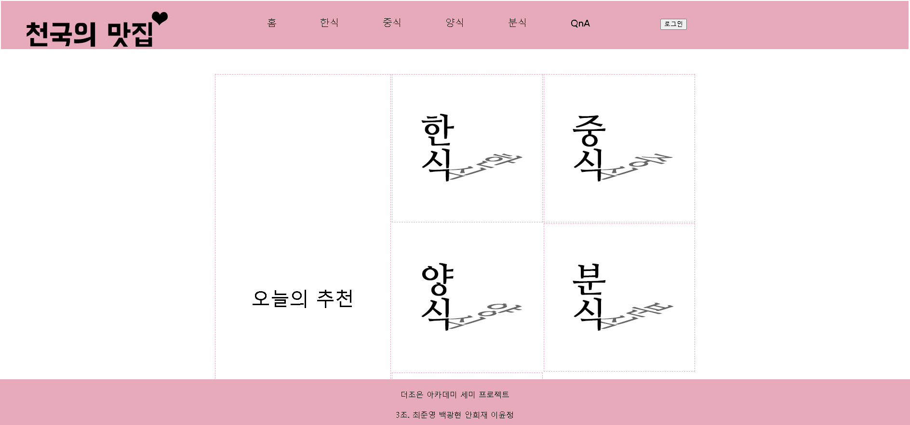
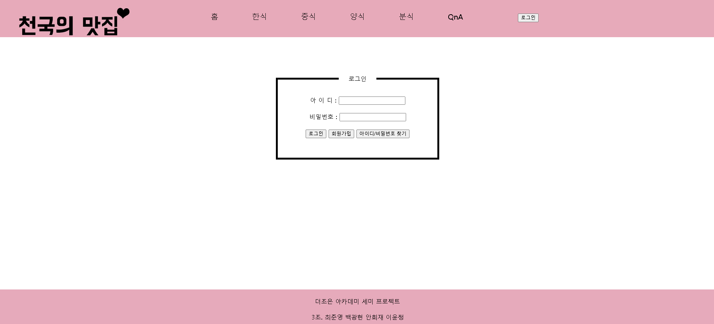
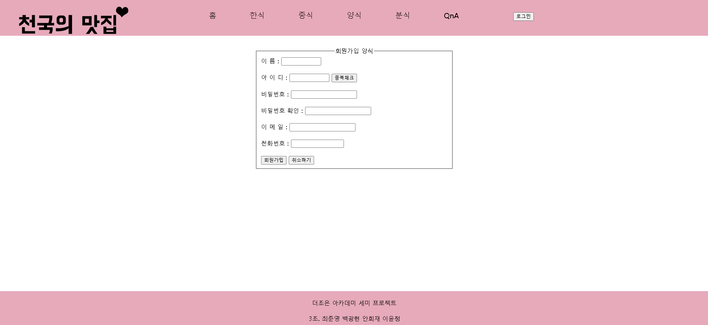
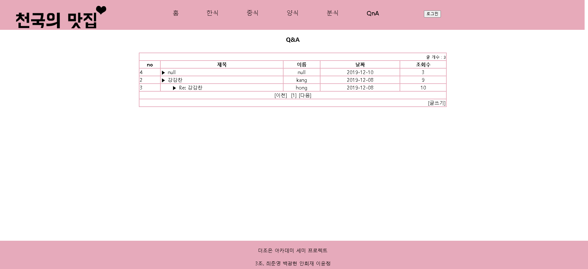

# WEB PROJECT

### 프로젝트 소개
**천국의 맛집**
맛집 소개 웹사이트로 종로구 지역맛집을 추천해주는 사이트

**프로젝트 기간** : 2019. 10 ~ 2019.11
**인원** : 4명
**기술스택** : HTML, CSS, JavaScript, JSP, Oracle DB

**맡은 역할** : 조장 - 팀 원들 간의 전체 일정 조율 및 부족한 부분을 계속 공유하도록 함 
로그인,회원가입 화면 구현과 DB연동을 통한 로그인 회원과 일반 방문자를 구분하여 로그인회원과 방문자를 구분하여 화면을 구현하도록 함

### 프로젝트 주요기능

 - 메인화면
 - 한식, 중식, 양식의 카테고리별 화면
 - 로그인 및 회원가입
 - 방명록(게시판)

#### 메인화면
처음으로 화면으로서 원하는 화면으로 바로 접근할 수 있도록 구현
클릭하면 랜덤으로 메뉴를 추천해주는 버튼도 함께 구현

#### 한식, 중식, 양식
음식의 종류별로 추천 식당을 보여주는 화면 구현, 로그인 했을 시 식당을 직접 등록하거나 수정할 수 있는 기능 구현

#### 로그인 및 회원가입
DB와 연동하여 로그인 및 회원가입 기능 구현 로그인을 해야지만 식당에 대한 글을 작성할 수 있도록 구현
- 로그인 화면

- 회원가입 화면

- 아이디/비밀번호 찾기 화면

#### QnA
게시판 및 방명록 기능으로 방문자들이 글을 남기거나 수정 및 댓글을 달 수 있도록 구현

